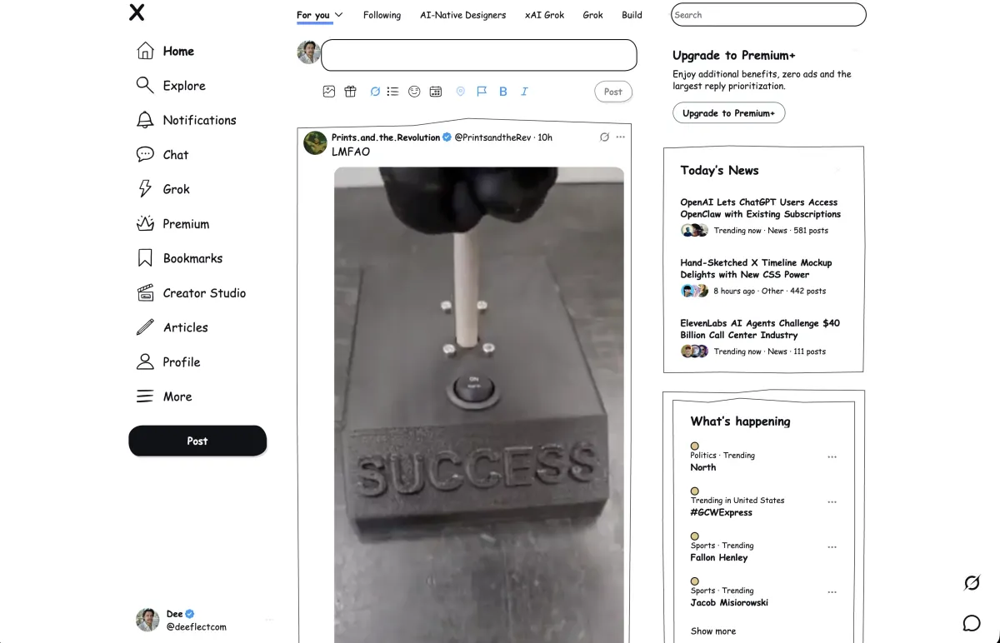
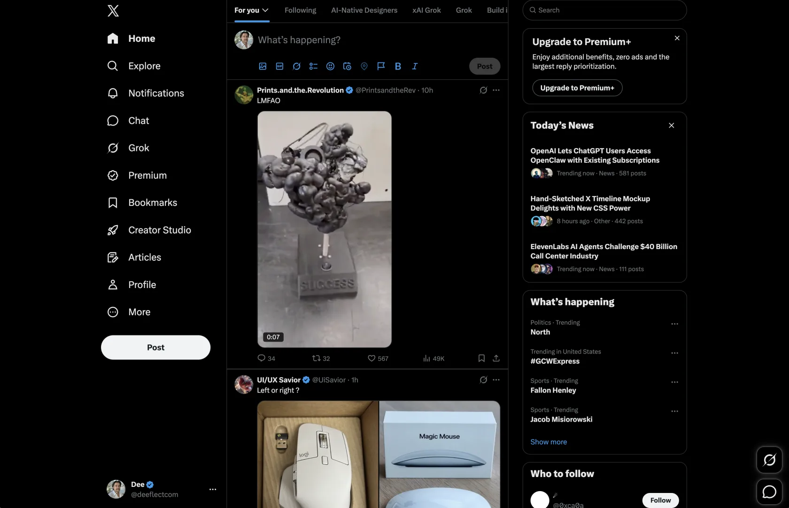
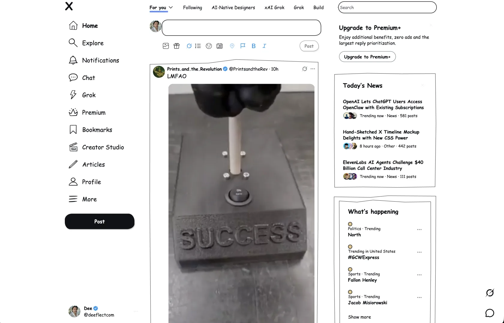

# Doodler

X, but somebody drew on it.

[doodler.deeflect.com](https://doodler.deeflect.com)



Doodler is a tiny no-build Chrome MV3 extension that makes X/Twitter look like a sketchy paper interface. It swaps in doodle icons, wobbly borders, light paper surfaces, and Comic Sans with an alarming amount of confidence.

It does not fix the posts. That would require a much larger ZIP file.

`chrome-extension` `manifest-v3` `x-twitter` `css` `no-build` `comic-sans-but-on-purpose`

## Before And After

| Before | After |
| --- | --- |
|  |  |

## What It Does

- Replaces the default X icon mood with local hand-drawn SVGs.
- Paints the timeline, sidebars, popovers, menus, and composer with paper UI.
- Adds sketchy borders because rectangles have had it too easy for too long.
- Stores one setting: whether Sketch mode is on.
- Does not collect, sell, analyze, launder, season, or emotionally process your data.

## Install The Weird Way

Until the Chrome Web Store listing is live, install it manually:

1. Download `dist/doodler-extension.zip`.
2. Unzip it. Yes, the ZIP must become not-a-ZIP. Computers are like this.
3. Open `chrome://extensions`.
4. Enable Developer mode.
5. Click Load unpacked.
6. Select the unzipped `doodler-extension` folder.
7. Visit `https://x.com`, open the Doodler popup, and turn on Sketch mode.

## Work On It Locally

There is no build step. This is suspiciously pleasant.

```bash
bash scripts/package-extension.sh
```

That writes `dist/doodler-extension.zip`, which is also what the website offers as the manual download.

If you add or rename icons, keep `manifest.json` `web_accessible_resources` in sync with `assets/icons/`. If you change popup/content files, run the packaging script again so the ZIP does not sit there lying to everyone.

## Website

The landing page is plain static HTML:

- `index.html`
- `assets/site.css`
- `assets/screenshots/*.webp`
- `dist/doodler-extension.zip`

Vercel can deploy this repo directly. Import `deeflect/doodler`, leave the framework preset as Other/Static, and let it serve the repo root. The included `vercel.json` only asks Vercel to keep URLs clean and otherwise stay out of the way.

## Privacy

Doodler asks Chrome for `storage` so the Sketch mode toggle can remember its state. It does not send extension data anywhere. The extension runs on `x.com` and `twitter.com` because that is where the rectangle soup lives.
